# Task Management & Time Tracking Application

A full-stack application for managing tasks and tracking time, built as part of SUNTEK AI's internship selection process.

## Assignment Status

| Area | Status | Implementation Details |
|------|--------|----------------------|
| Authentication | ✅ Complete | - Secure auth with protected routes<br>- User data isolation<br>- Login/Signup/Logout functionality |
| Task Management | ✅ Complete | - Natural language input<br>- AI-powered task generation<br>- Full CRUD operations<br>- Status management (Pending/In Progress/Completed) |
| Time Tracking | ✅ Complete | - Real-time timer<br>- Start/Stop functionality<br>- Session logging<br>- Per-task time tracking |
| Backend/API | ✅ Complete | - Clean, secure APIs<br>- Input validation<br>- Error handling<br>- Proper HTTP status codes |
| Deployment | ✅ Complete | - Fully deployed on Render.com<br>- Frontend & Backend services<br>- MongoDB Atlas integration |
| UI/UX | ✅ Complete | - Clean, responsive design<br>- User-friendly interface<br>- Matches Suntek AI branding |
| Code Quality | ✅ Complete | - Modular, readable code<br>- Structured project layout<br>- Proper documentation |

## Live Deployment 🌐

Primary: [Vercel](https://task-tracker-101.vercel.app)
Other: [Render](https://task-tracker-101.onrender.com)

## Features

### Authentication

- Secure user registration and login
- Protected routes and data isolation
- JWT-based authentication

> See screenshots: [Sign In](#authentication-1), [Sign Up](#authentication-1), [Email Verification](#authentication-1)

### Task Management

- Create tasks with natural language input
- AI-powered task title and description generation
- View, edit, and delete tasks
- Task status management (Pending, In Progress, Completed)

> See screenshots: [Home Page](#task-management-1), [Manual Task Creation](#task-management-1), [AI Task Creation](#task-management-1)

### Time Tracking

- Real-time timer for tasks
- Start/Stop functionality
- Session-based time logging
- Total time tracking per task

> See screenshot: [Task Menu](#time-tracking-1)

## Daily Summary

- Overview of daily tasks
- Total time tracked
- Task completion status
- Progress tracking

> See screenshots: [Dashboard](#daily-summary-1), [Daily Summary](#daily-summary-1)

## Tech Stack

### Frontend

- React.js
- Tailwind CSS
- Vite
- Axios for API calls

### Backend

- Node.js
- Express.js
- MongoDB
- JWT for authentication

## Local Development Setup

1. Clone the repository

    ```bash
    git clone https://github.com/h-sharda/Suntek-Assignment-Task-Management-App.git
    ```

2. Install dependencies and build React App

    ```bash
    # Install 
    cd backend
    npm run build
    ```

3. Set up environment variables

    ```bash
    # In backend directory
    cp .env.example .env
    # Fill in the required environment variables
    ```

4. Start the servers (from **/backend** )

    ```bash
    # Start development server 
    npm run dev

    # Start main server 
    npm start
    ```

## Deployment

The application is deployed on Render.com with the following components:

- Frontend: Static site hosting
- Backend: Web service
- Database: MongoDB Atlas

## Disclaimer

This project is a private assignment for SUNTEK AI's internship selection process. All branding, logos, and design are used solely for internal demonstration and not for commercial or personal use.

The website template and formatting is based on the official site: [Suntek AI](https://suntek.ai/)

## Dev Notes

### CSS color pallete

CSS color pallette to match the pallette of company's website:

- background white: #fefeff
- overlay white: #f6f8fe
- blue color: #2d3ec5
- primary black text: #010001
- secondary gray text: #323233

## Screenshots

### Authentication

<div align="center">
  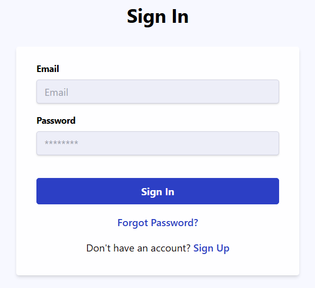
  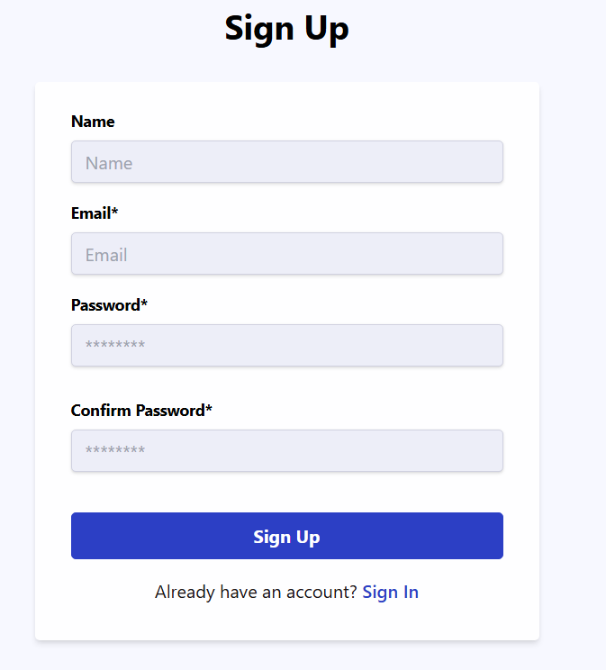
  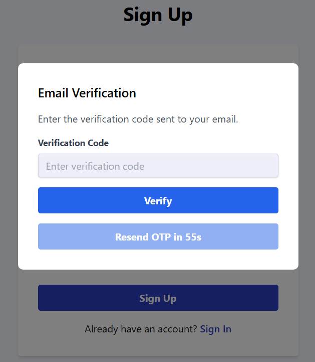
</div>

### Task Management

<div align="center">
  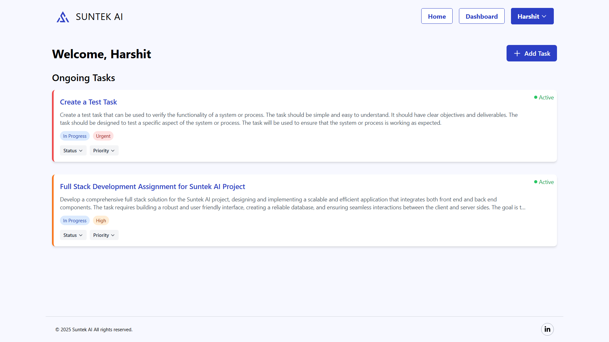
</div>

<div align="center">
  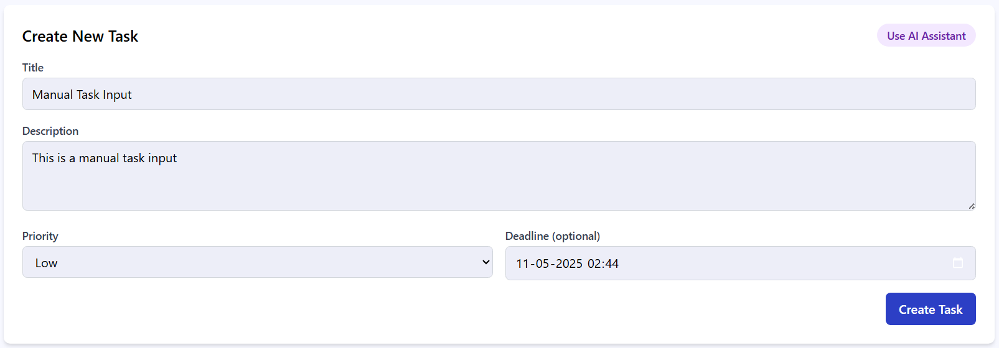
</div>

<div align="center">
  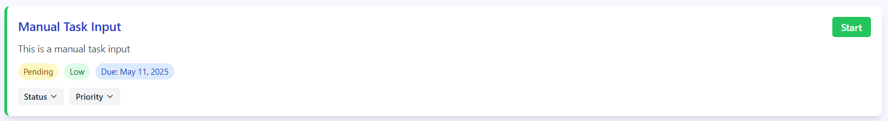
</div>

<div align="center">
  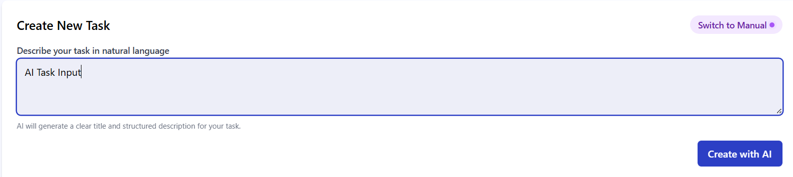
</div>

<div align="center">
  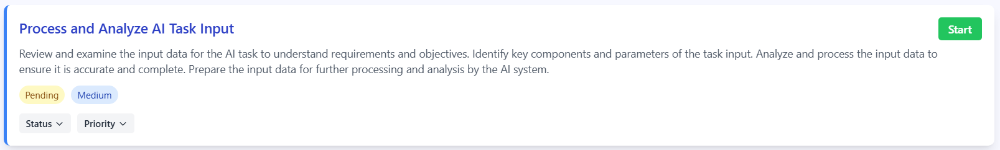
</div>

### Time Tracking

<div align="center">
  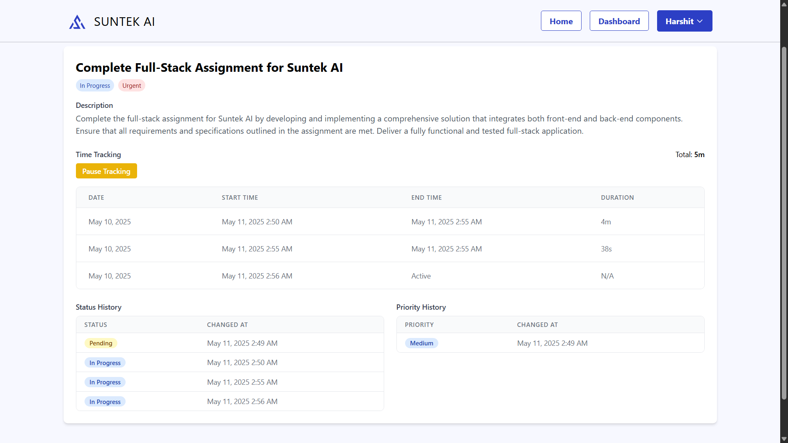
</div>

### Daily Summary

<div align="center">
  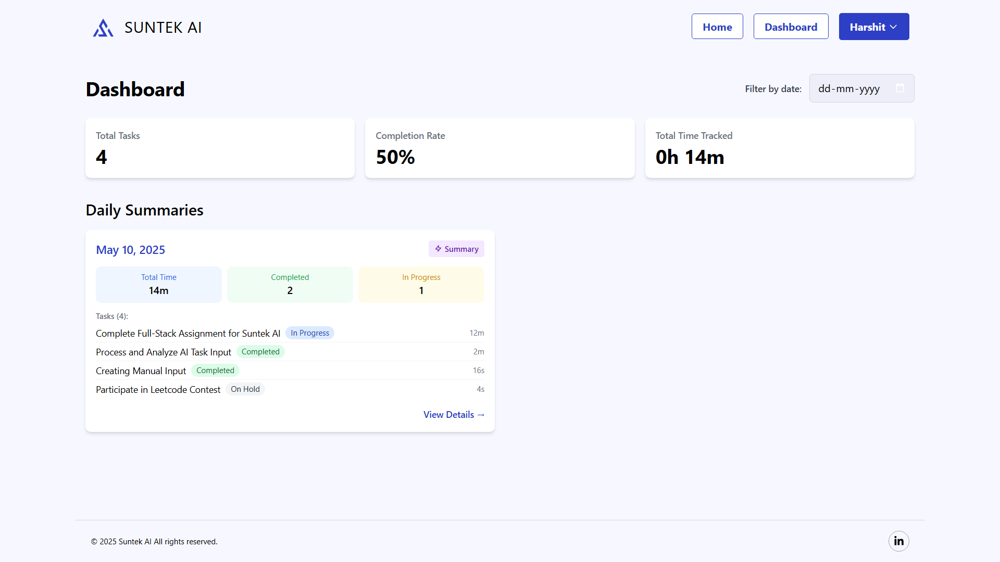
</div>

<div align="center">
  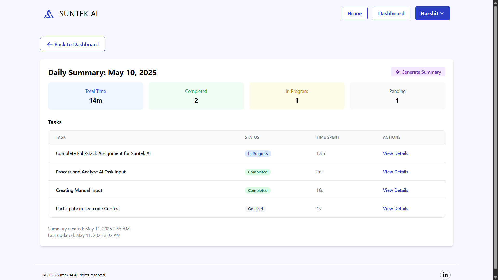
</div>
